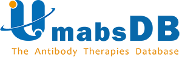

#### 简介

人工智能及生物医学协会（IHS）是由北美从事人工智能及生物医药研究的华人学者自发组织的非盈利组织。 我们旨在增进从事人工智能及生物科技研究的华人之间的交流、学习和合作。 协会每周将会邀请在自己领域学术突出的学者就自己的研究课题进行学术汇报。汇报主要以中文或英文的形式在 YouTube Channel 或者 bilibili 网站直播或录播。 欢迎从事人工智能，计算机科学，遗传学、基因组学、生物信息学、生物统计学、进化生物学，神经生物学，分子生物学相关领域的华人同学（包括本、硕、博和博后）和老师参与。

IHS学术沙龙每周邀请一到两位学者就自己的研究课题进行学术汇报。汇报主要以中文的形式在[YouTube](https://www.youtube.com/channel/UCk4tsPZOzGkP2IaU4YvUG_g/videos) Channel和[Bilibili](https://space.bilibili.com/298768313)播放。

我们正处在由研究一般的物理学、化学等的自然规律到研究人的思维规律、智能推理的一个伟大转变时期，正处在如火如茶进行着的第四次工业技术革命的巨大浪潮中。人工智能已经从仅限于书斋里的研究走向了科学技术，工程实践，走向了医药卫生，以至于普通的日常生活的人类社会的各个方面。机器人，无人驾驶汽车，无人工厂，无人实验室，无人飞机，智能诊断，智能基因组学和智能药物的发展正在蓬勃兴起。为推动人工智能的迅速发展和在健康科学和医学中的广泛应用尽一点微薄之力，我们将组织讲座，课程教学，报告人工智能和在健康中的广泛应用的新闻，会议，论文，组织这方面的研究，讨论它的发展方向，交流科研成果和推动人材的培养。人工智能的研究和应用是大众的事业。我们热切希望广大教授，科学家，学生，医疗卫生战线和工业界同行门的广泛参与和共同奋斗，共同建设我们这个社群，以期今后发展成为一个推动人工智能研究和在健康、医疗和卫生中的广泛应用，具有巨大生命力的一个学会。

**[欢迎加入我们的微信群!]()** 也欢迎广大华人学者在此平台介绍自己的学术工作，联系邮箱Email:[Momiao.Xiong@gmail.com](mailto:Momiao.Xiong@gmail.com)

#### 微信公众号：

#### YouTuBe 和 B站：

[https://www.youtube.com/channel/UCwYrwLEn8p8ejz3CfUuvgkw](https://www.youtube.com/channel/UCwYrwLEn8p8ejz3CfUuvgkw)

[https://www.bilibili.tv/en/space/1568868193](https://www.bilibili.tv/en/space/1568868193)

#### 人工智能程序集：

https://github.com/Ai2healthcare

#### 特约赞助:

**Platinum Sponsor!**

**Gold Sponsors!**

**Silver Sponsors!**

**Bronze Sponsors!**
